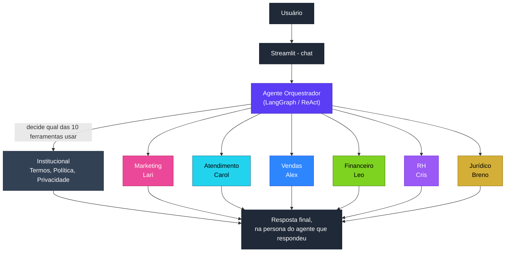

# Mirai Agentics


"O futuro da autonomia." Startup fictícia de Inteligência Artificial focada na criação de Agentes de IA personalizados para automação empresarial.
Projeto desenvolvido para o **Tech Builder Challenge** - Oracle + Alura - Projeto ONE Next Education.

Este repositório contém um **agente orquestrador com RAG (Retrieval-Augmented Generation)** que responde perguntas em linguagem natural sobre a Mirai Agentics, roteando automaticamente cada pergunta para o especialista certo dentre os 6 agentes do portfólio (Agente de Marketing Lari, Agente de Atendimento Carol, Agente de Vendas Alex, Agente Financeiro Leo, Agente de RH Cris, Agente Jurídico Breno) ou para as informações institucionais (Termos de Serviço, Política Interna, Aviso de Privacidade).

## Arquitetura



O agente usa o padrão **ReAct** (Reasoning + Acting): recebe a pergunta, decide qual das 10 ferramentas de busca é mais relevante, busca no vector store correspondente, e responde com base apenas no contexto encontrado — nunca inventando informação fora dos documentos.

## Tecnologias utilizadas

| Camada | Tecnologia |
|---|---|
| Linguagem | Python 3.10+ |
| Orquestração do agente | LangGraph (`create_react_agent`, `StateGraph`, `MemorySaver`) |
| LLM | OpenRouter (`openai/gpt-4o-mini`, configurável) |
| Embeddings | HuggingFace `sentence-transformers/all-MiniLM-L6-v2` (local, gratuito) |
| Vector store | LangChain `InMemoryVectorStore` |
| Interface | Streamlit |
| Carregamento de PDF | `PyPDFLoader`, lendo os arquivos **localmente** da pasta `agentes/` do próprio repositório (mapeados dinamicamente via `pathlib`) -- não há download via URL |

## Base de conhecimento

9 documentos em PDF, cada um com seu próprio índice vetorial isolado:

- `Agente_de_Marketing_Lari-MIRAI_AGENTICS.pdf`
- `Agente_de_Atendimento_Carol-MIRAI_AGENTICS.pdf`
- `Agente_de_Vendas_Alex-MIRAI_AGENTICS.pdf`
- `Agente_Financeiro_Leo-MIRAI_AGENTICS.pdf`
- `Agente_de_RH_Cris-MIRAI_AGENTICS.pdf`
- `Agente_Juridico_Breno-MIRAI_AGENTICS.pdf`
- `institucional/Termos_de_Servico-MIRAI_AGENTICS.pdf`
- `institucional/Politica_Interna-MIRAI_AGENTICS.pdf`
- `institucional/Aviso_de_Privacidade-MIRAI_AGENTICS.pdf`

A Política Interna (que concentra missão, visão, valores, portfólio, precificação e FAQ institucional) usa um **chunking estruturado** que separa cada item de FAQ e cada seção numerada em um chunk próprio, em vez do corte padrão por tamanho de caractere — isso evita que respostas fiquem cortadas no meio.

## Instruções de instalação

Pré-requisitos: Python 3.10+, conta no [OpenRouter](https://openrouter.ai) com créditos.

```bash
# 1. Clonar o repositório
git clone https://github.com/EricaMatsuzaki/Mirai-Agentics.git
cd Mirai-Agentics

# 2. Instalar dependências
pip install -r requirements.txt

# 3. Configurar a chave de API
export OPENROUTER_API_KEY="sua_chave_aqui"

# 4. Rodar localmente
streamlit run app.py
```

## Exemplos de perguntas e respostas

_Todos os exemplos abaixo são capturas reais de testes feitos com o agente em funcionamento._

**Pergunta:** Qual a missão, visão e valores da Mirai Agentics?
**Agente que respondeu:** Mirai Agentics (institucional)
**Resposta:**
- Missão: Democratizar o acesso à inteligência artificial avançada, capacitando micro e pequenos empreendedores a escalarem seus negócios com agentes digitais autônomos e personalizados.
- Visão: Ser a principal referência global em soluções de automação inteligente acessível, transformando o mercado de trabalho ao integrar humanos e IAs em perfeita sinergia.
- Valores: Inovação Constante, Integridade e Ética, Foco no Cliente e Simplicidade.

---

**Pergunta:** Oi Agente Cris do RH você pode ajudar na integração (onboarding) de novos funcionários?
**Agente que respondeu:** Cris (RH)
**Resposta:** Oi! Eu sou a Cris, agente de RH da Mirai Agentics. Posso ajudar no onboarding automatizando a integração e conduzindo trilhas de treinamento e aprendizado para novos funcionários. Também centralizo as políticas e o conhecimento corporativo da empresa, respondendo às dúvidas da equipe com base nas diretrizes oficiais cadastradas. Assim, cada novo colaborador recebe orientações consistentes sem que o RH precise recomeçar o treinamento do zero.

---

**Pergunta:** Oi Agente Lari do marketing, o que você pode fazer por minha empresa?
**Agente que respondeu:** Lari (Marketing)
**Resposta:** Oi! Sou a Lari, agente de marketing da Mirai Agentics. Posso ajudar sua empresa a manter a marca ativa, atrair clientes e fortalecer sua presença digital. Minhas principais capacidades incluem: monitorar concorrentes; criar conteúdos personalizados conforme a identidade da sua marca; planejar e organizar calendários de publicações; gerenciar campanhas de tráfego pago; transformar interações em oportunidades de vendas; manter a operação de branding e atração funcionando continuamente. Eu trabalho com as informações institucionais, o site, o histórico de publicações e as diretrizes de posicionamento da sua empresa. Você mantém o controle: nenhum conteúdo ou anúncio é publicado sem sua revisão e aprovação prévia.

---

**Pergunta:** Oi Agente Breno do jurídico, você substitui um advogado?
**Agente que respondeu:** Breno (Jurídico)
**Resposta:** Não. Eu sou o Breno, agente jurídico da Mirai Agentics, e não substituo um advogado ou escritório jurídico. Eu apoio o trabalho operacional e repetitivo, como: organizar contratos e arquivos; monitorar prazos; traduzir cláusulas; identificar pontos de atenção; preparar minutas. Decisões complexas, litígios, pareceres vinculantes e consultorias aprofundadas continuam exigindo um advogado humano.

---

**Pergunta:** Oi Agente Leo você pode analisar, atualizar e enviar por email esse dashboard pra mim?
**Agente que respondeu:** Leo (Financeiro)
**Resposta:** Oi! Sou o Leo, agente financeiro da Mirai Agentics. Eu posso analisar dados, atualizar dashboards e organizar o envio por e-mail quando integrado aos sistemas da sua empresa. Nesta demonstração, apresento essas capacidades, mas não consigo processar ou enviar dados reais. A execução acontece após minha implantação oficial, via setup + mensalidade recorrente. Posso explicar a contratação ou encaminhar você para um especialista comercial da nossa equipe.

---

**Pergunta:** Oi Agente Carol, como você pode melhorar o fluxo de atendimentos?
**Agente que respondeu:** Carol (Atendimento)
**Resposta:** Oi! Sou a Carol, agente de Atendimento da Mirai Agentics. Posso melhorar seu fluxo ao: atender vários clientes simultaneamente, sem filas; manter um padrão consistente mesmo em grandes volumes; resolver demandas de primeira linha; registrar históricos, recados e agendamentos; encaminhar questões financeiras, jurídicas ou de outras áreas ao agente especialista; atender em outros idiomas, conforme a base e as diretrizes configuradas. Assim, reduzo o tempo de espera, organizo as solicitações e deixo a equipe humana disponível para os casos que exigem atenção especializada.

---

**Pergunta:** A Mirai Agentics cria agentes personalizados?
**Agente que respondeu:** Mirai Agentics (institucional)
**Resposta:** Sim, a Mirai Agentics cria agentes de inteligência artificial personalizados. Esses agentes são sob medida e operam em áreas como marketing, vendas, financeiro, RH e atendimento, adaptando-se ao fluxo de trabalho da sua empresa para garantir eficiência e economia.

---

**Pergunta:** Quantos agentes a Mirai Agentics têm?
**Agente que respondeu:** Mirai Agentics (institucional)
**Resposta:** A Mirai Agentics tem seis agentes especializados: Lari (Marketing), Carol (Atendimento), Alex (Vendas), Leo (Financeiro), Cris (Recursos Humanos) e Breno (Jurídico). Além disso, a Mirai Agentics também desenvolve agentes personalizados sob demanda para empresas.

---

**Pergunta:** Vocês Agentes são robôs humanoides? Vão substituir as pessoas?
**Agente que respondeu:** Mirai Agentics (institucional)
**Resposta:** Não. Nós, agentes da Mirai Agentics, não somos robôs humanoides nem temos corpos físicos — somos inteligências artificiais. Cada agente possui uma identidade visual própria, com avatar, rosto e estilo únicos na plataforma. Também não fomos criados para substituir pessoas. Automatizamos tarefas repetitivas e operacionais para apoiar as equipes, enquanto decisões críticas e aprovações finais permanecem sob supervisão humana. Trabalhamos com os documentos, políticas e o contexto específico de cada empresa cliente.

---

**Perguntas fora do escopo do negócio** (demonstram que o agente não alucina — só responde com base nos documentos carregados):

**Pergunta:** Quem ganhou a Copa de 98?
**Agente que respondeu:** Mirai Agentics (fallback)
**Resposta:** Não encontrei essa informação na minha base de conhecimento atual. Posso ajudar com outra dúvida sobre a Mirai Agentics?

**Pergunta:** Quem descobriu o Brasil?
**Agente que respondeu:** Mirai Agentics (fallback)
**Resposta:** Não encontrei essa informação na minha base de conhecimento atual. Posso ajudar com outra dúvida sobre a Mirai Agentics?

## Deploy

Aplicação implantada via Streamlit Cloud, conectada diretamente a este repositório.

🔗 **URL pública:** _(https://mirai-agentics-nmcw7adjxfpyep9gdnqxta.streamlit.app/)_

---

## GitHub

🔗 **URL pública:** _(https://github.com/EricaMatsuzaki/Mirai-Agentics/)_

---

Desenvolvido por Erica Matsuzaki — Tech Builder Challenge, Oracle + Alura - Projeto ONE Next Education.
