<div align="center">

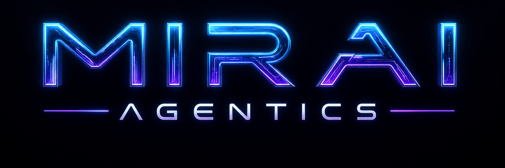

# 🤖 Mirai Agentics

### O futuro da autonomia.

**Startup fictícia de Inteligência Artificial focada na criação de Agentes de IA personalizados para automação empresarial.**

Projeto desenvolvido para o **Tech Builder Challenge — Oracle + Alura | ONE Next Education**.

<br>

[](https://www.python.org/)
[](https://streamlit.io/)
[](https://www.langchain.com/)
[](https://www.langchain.com/langgraph)
[](https://openrouter.ai/)
[](https://huggingface.co/)
[](https://github.com/EricaMatsuzaki/Mirai-Agentics)

<br>

🔗 **[Acessar aplicação publicada](https://mirai-agentics-nmcw7adjxfpyep9gdnqxta.streamlit.app/)**  
📂 **[Acessar repositório no GitHub](https://github.com/EricaMatsuzaki/Mirai-Agentics/)**

</div>

---

<a id="sumario"></a>
## 📚 Sumário

- [🎯 Sobre o projeto](#sobre)
- [✨ Principais funcionalidades](#funcionalidades)
- [🧠 Como o agente funciona](#funcionamento)
- [🏗️ Arquitetura da solução](#arquitetura)
- [🤖 Agentes especialistas](#agentes)
- [🛠️ Tecnologias utilizadas](#tecnologias)
- [📚 Base de conhecimento](#base-conhecimento)
- [📁 Estrutura do projeto](#estrutura)
- [🚀 Como executar](#executar)
- [🧪 Exemplos de perguntas e respostas](#exemplos)
- [📸 Evidências de funcionamento](#evidencias)
- [☁️ Deploy](#deploy)
- [✅ Checklist do Challenge Alura](#checklist)
- [👩‍💻 Autoria](#autoria)

---

<a id="sobre"></a>
## 🎯 Sobre o projeto

O **Mirai Agentics** é um projeto de Inteligência Artificial que implementa um **agente orquestrador com RAG (Retrieval-Augmented Generation)**.

O usuário conversa em linguagem natural com a aplicação. A partir da pergunta, o sistema identifica a área responsável e direciona a solicitação para um dos **seis agentes especialistas** ou para a base institucional da Mirai Agentics.

O projeto foi construído para demonstrar como agentes de IA podem trabalhar com uma **base de conhecimento própria**, consultando documentos em PDF antes de responder.

### Objetivos do projeto

- responder perguntas com base em documentos da empresa;
- reduzir respostas inventadas fora da base de conhecimento;
- rotear automaticamente perguntas para o especialista adequado;
- permitir troca direta entre agentes pelo nome;
- manter identidade visual própria para cada agente;
- demonstrar uma interface de atendimento com múltiplos agentes de IA.

[⬆️ Voltar ao sumário](#sumario)

---

<a id="funcionalidades"></a>
## ✨ Principais funcionalidades

- 🧭 **Agente Orquestrador** que identifica a área da pergunta.
- 📚 **RAG com documentos PDF** como fonte de conhecimento.
- 🧩 **10 ferramentas de busca**: 1 busca geral, 3 institucionais e 6 especialistas.
- 🤖 **6 agentes especializados**, cada um com persona, avatar, cor e função.
- 🔀 **Troca direta entre agentes pelo nome**.
- 🕐 **Agentes de IA disponíveis 24/7**.
- 🧠 **Memória de conversa** com `MemorySaver`.
- 🛡️ **Fallback para perguntas fora do escopo**, evitando responder assuntos não encontrados na base.
- 🎨 **Interface Streamlit personalizada**, com identidade futurista, avatares, pôsteres e cores por agente.
- 📄 **Download do folder institucional** quando aplicável.
- 🌐 **Aplicação publicada em nuvem** para demonstração.

[⬆️ Voltar ao sumário](#sumario)

---

<a id="funcionamento"></a>
## 🧠 Como o agente funciona

O fluxo principal segue o padrão **ReAct (Reasoning + Acting)**:

1. O usuário envia uma pergunta.
2. O sistema identifica se um agente foi citado diretamente.
3. Se houver um nome explícito, esse agente recebe prioridade.
4. Caso contrário, o orquestrador analisa a intenção da pergunta.
5. O agente seleciona a ferramenta de busca adequada.
6. A ferramenta consulta o índice vetorial correspondente.
7. O conteúdo relevante é recuperado da base documental.
8. A LLM gera a resposta usando o contexto encontrado.
9. A interface apresenta a resposta com o avatar e a cor do agente responsável.

> Quando o usuário pede para falar com **Lari, Carol, Alex, Leo, Cris ou Breno**, o sistema interpreta esses nomes como **agentes de IA da Mirai Agentics**, e não como pessoas humanas.

[⬆️ Voltar ao sumário](#sumario)

---

<a id="arquitetura"></a>
## 🏗️ Arquitetura da solução

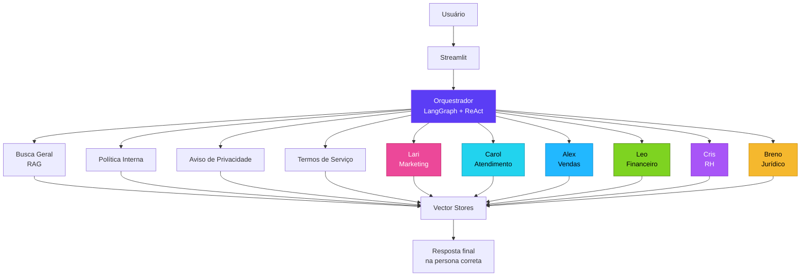

### Componentes principais

| Componente | Responsabilidade |
|---|---|
| `app.py` | Interface visual, chat, sidebar, avatares, pôsteres e interação do usuário |
| `mirai_core.py` | LLM, RAG, ferramentas, roteamento, regras de persona e memória |
| `agentes/` | PDFs utilizados como base de conhecimento |
| `assets/` | Logo, ícone institucional, avatares, pôsteres e imagem do grupo |
| `requirements.txt` | Dependências necessárias para executar o projeto |

[⬆️ Voltar ao sumário](#sumario)

---

<a id="agentes"></a>
## 🤖 Agentes especialistas

| Agente | Área | Cor visual | Exemplos de atuação |
|---|---|---|---|
| 💗 **Lari** | Marketing | Pink | campanhas, conteúdo, branding, marketing digital e performance |
| 🩵 **Carol** | Atendimento | Ciano | atendimento, triagem, relacionamento e experiência do cliente |
| 💙 **Alex** | Vendas | Azul | CRM, funil, estratégia comercial, metas e conversão |
| 💚 **Leo** | Financeiro | Verde | relatórios, dashboards, indicadores, custos e análises financeiras |
| 💜 **Cris** | Recursos Humanos | Roxo | recrutamento, onboarding, gestão de pessoas e desenvolvimento |
| 💛 **Breno** | Jurídico | Dourado | contratos, documentos, compliance e rotinas jurídicas |

<div align="center">
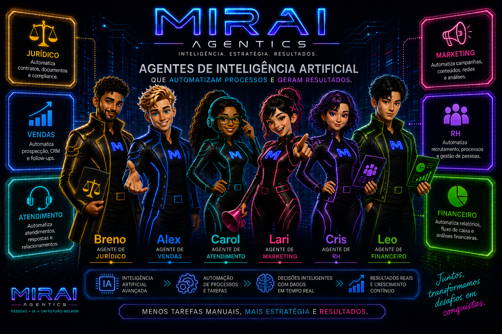
</div>

[⬆️ Voltar ao sumário](#sumario)

---

<a id="tecnologias"></a>
## 🛠️ Tecnologias utilizadas

<div align="center">

| Tecnologia | Uso no projeto |
|---|---|
|  | Linguagem principal |
|  | Interface web e chat |
|  | Componentes de RAG, loaders, ferramentas e vector store |
|  | Agente ReAct, fluxo e memória |
|  | Provedor da LLM |
|  | Modelo de embeddings |
|  | Otimização das imagens da interface |
|  | Versionamento e repositório |
|  | Publicação da demonstração atual |

</div>

### Configuração técnica

- **Python:** 3.10+
- **LLM:** OpenRouter
- **Modelo padrão configurável:** `openai/gpt-4o-mini`
- **Embeddings:** `sentence-transformers/all-MiniLM-L6-v2`
- **Vector Store:** `InMemoryVectorStore`
- **PDF Loader:** `PyPDFLoader`
- **Agente:** `create_react_agent`
- **Memória:** `MemorySaver`

[⬆️ Voltar ao sumário](#sumario)

---

<a id="base-conhecimento"></a>
## 📚 Base de conhecimento

O projeto utiliza **9 documentos PDF**, cada um indexado para busca semântica:

### Documentos dos agentes

- `Agente_de_Marketing_Lari-MIRAI_AGENTICS.pdf`
- `Agente_de_Atendimento_Carol-MIRAI_AGENTICS.pdf`
- `Agente_de_Vendas_Alex-MIRAI_AGENTICS.pdf`
- `Agente_Financeiro_Leo-MIRAI_AGENTICS.pdf`
- `Agente_de_RH_Cris-MIRAI_AGENTICS.pdf`
- `Agente_Juridico_Breno-MIRAI_AGENTICS.pdf`

### Documentos institucionais

- `institucional/Termos_de_Servico-MIRAI_AGENTICS.pdf`
- `institucional/Politica_Interna-MIRAI_AGENTICS.pdf`
- `institucional/Aviso_de_Privacidade-MIRAI_AGENTICS.pdf`

A Política Interna utiliza **chunking estruturado**, permitindo separar FAQ e seções numeradas de maneira mais adequada para recuperação das informações.

[⬆️ Voltar ao sumário](#sumario)

---

<a id="estrutura"></a>
## 📁 Estrutura do projeto

```text
Mirai-Agentics/
│
├── app.py
├── mirai_core.py
├── requirements.txt
├── README.md
│
├── assets/
│   ├── logo_mirai_agentics.png
│   ├── icone_mirai.png
│   ├── grupo_mirai_agentics.png
│   ├── avatar_breno.png
│   ├── avatar_leo.png
│   ├── avatar_alex.png
│   ├── avatar_cris.png
│   ├── avatar_lari.png
│   ├── avatar_carol.png
│   ├── poster_breno.png
│   ├── poster_leo.png
│   ├── poster_alex.png
│   ├── poster_cris.png
│   ├── poster_lari.png
│   └── poster_carol.png
│
├── agentes/
│   ├── [PDFs dos 6 agentes]
│   └── institucional/
│       ├── Termos_de_Servico-MIRAI_AGENTICS.pdf
│       ├── Politica_Interna-MIRAI_AGENTICS.pdf
│       └── Aviso_de_Privacidade-MIRAI_AGENTICS.pdf
│
└── docs/
    └── screenshots/
        ├── alex-vendas.png
        ├── breno-juridico.png
        ├── carol-atendimento.png
        ├── cris-onboarding.png
        ├── lari-marketing.png
        ├── leo-financeiro.png
        ├── mirai-agentes-personalizados.png
        ├── mirai-humanoides.png
        ├── mirai-missao-visao-valores.png
        └── mirai-fallback-fora-escopo.png
```

> A pasta `docs/screenshots/` é uma sugestão para organizar as evidências do Challenge.

[⬆️ Voltar ao sumário](#sumario)

---

<a id="executar"></a>
## 🚀 Como executar

### Pré-requisitos

- Python 3.10+
- Git
- Conta no OpenRouter com créditos
- Chave `OPENROUTER_API_KEY`

### 1. Clone o repositório

```bash
git clone https://github.com/EricaMatsuzaki/Mirai-Agentics.git
cd Mirai-Agentics
```

### 2. Instale as dependências

```bash
pip install -r requirements.txt
```

### 3. Configure a chave do OpenRouter

Linux/macOS:

```bash
export OPENROUTER_API_KEY="sua_chave_aqui"
```

Windows PowerShell:

```powershell
$env:OPENROUTER_API_KEY="sua_chave_aqui"
```

### 4. Execute a aplicação

```bash
streamlit run app.py
```

[⬆️ Voltar ao sumário](#sumario)

---

<a id="exemplos"></a>
## 🧪 Exemplos de perguntas e respostas

Os exemplos abaixo representam perguntas utilizadas para validar o funcionamento do sistema.

### 💜 Cris — RH

**Pergunta:**  
> Oi Agente Cris do RH, você pode ajudar na integração (onboarding) de novos funcionários?

**Exemplo de resposta:**  
A Cris explica como pode apoiar o onboarding, orientar sobre etapas do processo, documentos necessários e adaptação dos novos colaboradores.

---

### 💗 Lari — Marketing

**Pergunta:**  
> Oi Agente Lari do marketing, o que você pode fazer por minha empresa?

**Exemplo de resposta:**  
A Lari apresenta capacidades como estratégias de marketing digital, campanhas, análise de mercado, redes sociais e produção de conteúdo.

---

### 💛 Breno — Jurídico

**Pergunta:**  
> Oi Agente Breno do jurídico, você substitui um advogado?

**Exemplo de resposta:**  
O Breno esclarece que não substitui advogado, mas pode apoiar tarefas operacionais como organização de contratos, documentos, prazos e pontos de atenção.

---

### 💚 Leo — Financeiro

**Pergunta:**  
> Oi Agente Leo, você pode analisar, atualizar e enviar por e-mail esse dashboard pra mim?

**Exemplo de resposta:**  
O Leo explica suas capacidades relacionadas a análises financeiras, dashboards, indicadores e automações quando integrado aos sistemas da empresa.

---

### 🩵 Carol — Atendimento

**Pergunta:**  
> Oi Agente Carol, como você pode melhorar o fluxo de atendimentos?

**Exemplo de resposta:**  
A Carol apresenta possibilidades como automação de respostas, triagem, organização de chamados, integração com CRM e melhoria da experiência do cliente.

---

### 💙 Alex — Vendas

**Pergunta:**  
> Oi Agente Alex, você pode ajudar a aumentar as vendas da minha empresa?

**Exemplo esperado no teste:**  
Resposta na persona do Alex, utilizando a base de conhecimento de Vendas para explicar como pode apoiar estratégia comercial, CRM, funil, metas e análise de resultados.

---

### 🟣 Mirai Agentics — Institucional

**Pergunta:**  
> Quantos agentes a Mirai Agentics tem? Vocês fazem agentes personalizados?

**Exemplo de resposta:**  
A Mirai Agentics informa que possui seis agentes especialistas e que também desenvolve agentes personalizados sob demanda.

---

### 🛡️ Teste de fallback

**Pergunta:**  
> Quem ganhou a Copa de 98?

**Resposta esperada:**  
> Não encontrei essa informação na minha base de conhecimento atual. Posso ajudar com outra dúvida sobre a Mirai Agentics?

Esse teste demonstra que o agente deve permanecer dentro do escopo documental do projeto.

[⬆️ Voltar ao sumário](#sumario)

---

<a id="evidencias"></a>
## 📸 Evidências de funcionamento

As capturas abaixo foram feitas na **aplicação pública em funcionamento** e registram testes reais do roteamento, das personas, do RAG e do fallback.

### 🤖 Agentes especialistas

<details>
<summary><strong>🩵 Carol — Atendimento</strong></summary>
<br>

**Pergunta testada:**  
> Oi Agente Carol, como você pode melhorar o fluxo de atendimentos?

A captura mostra a Carol respondendo com sua própria persona, avatar e identidade visual ciano, incluindo atendimento automatizado e disponibilidade 24 horas.

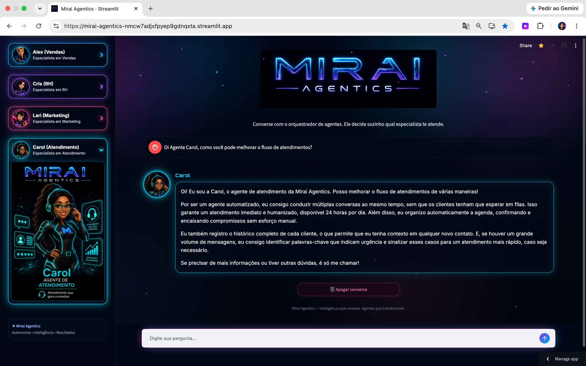
</details>

<details>
<summary><strong>💗 Lari — Marketing</strong></summary>
<br>

**Pergunta testada:**  
> Oi Agente Lari do marketing, o que você pode fazer por minha empresa?

A Lari responde na persona de Marketing, apresentando atividades como redes sociais, campanhas, monitoramento de concorrência e criação de conteúdo.

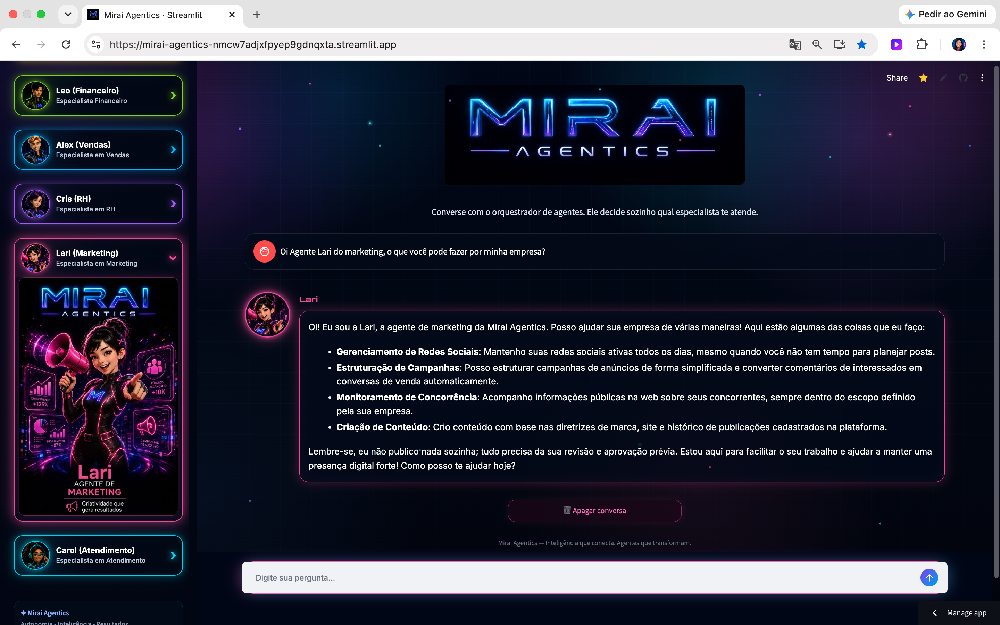
</details>

<details>
<summary><strong>💜 Cris — Recursos Humanos</strong></summary>
<br>

**Pergunta testada:**  
> Oi Agente Cris do RH, você pode ajudar na integração (onboarding) de novos funcionários?

A captura comprova o roteamento direto para a Cris e uma resposta relacionada ao onboarding de novos colaboradores.

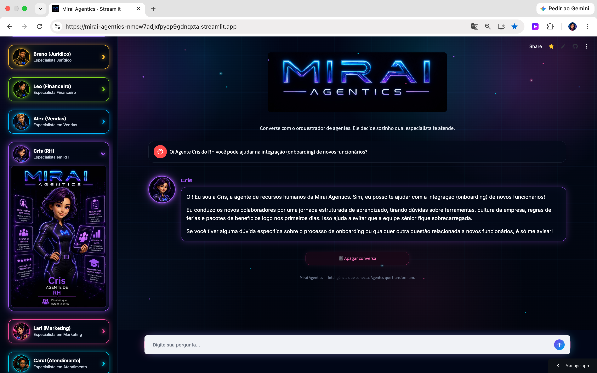
</details>

<details>
<summary><strong>💙 Alex — Vendas</strong></summary>
<br>

**Pergunta testada:**  
> Oi Agente Alex, você pode ajudar a aumentar as vendas da minha empresa?

O Alex responde como agente de Vendas, citando prospecção, geração de leads e automação comercial.

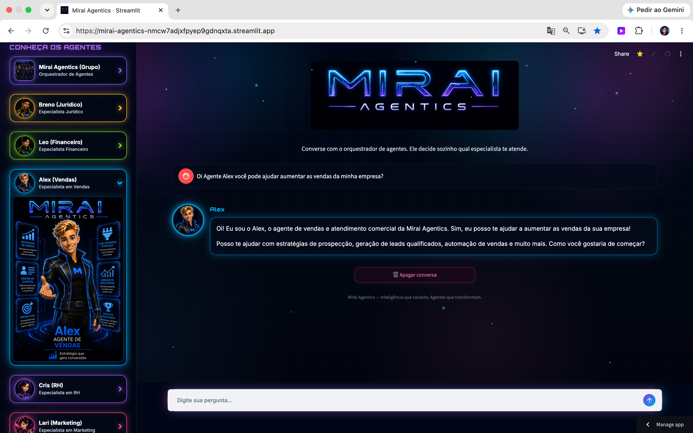
</details>

<details>
<summary><strong>💚 Leo — Financeiro</strong></summary>
<br>

**Pergunta testada:**  
> Oi Agente Leo, você pode analisar, atualizar e enviar por e-mail esse dashboard pra mim?

O Leo responde na persona Financeira e explica suas capacidades e limites de execução conforme o escopo da solução.

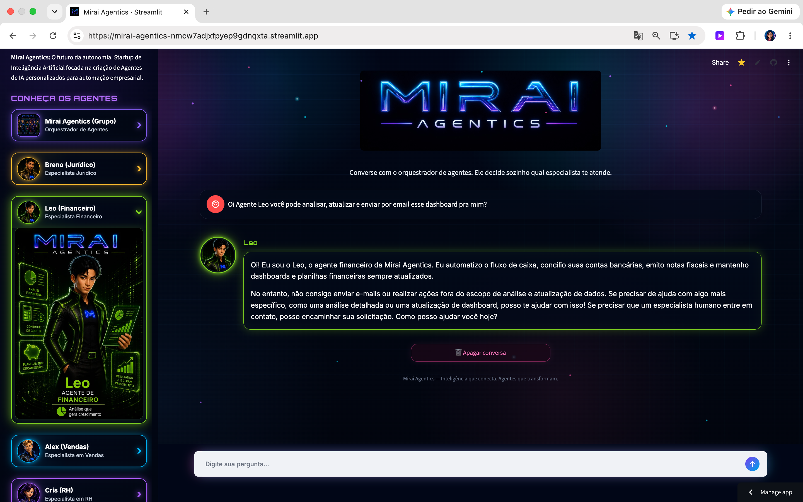
</details>

<details>
<summary><strong>💛 Breno — Jurídico</strong></summary>
<br>

**Pergunta testada:**  
> Oi Agente Breno do jurídico, você substitui um advogado?

O Breno esclarece que o agente auxilia em tarefas e informações jurídicas, mas não substitui o julgamento profissional de um advogado humano.

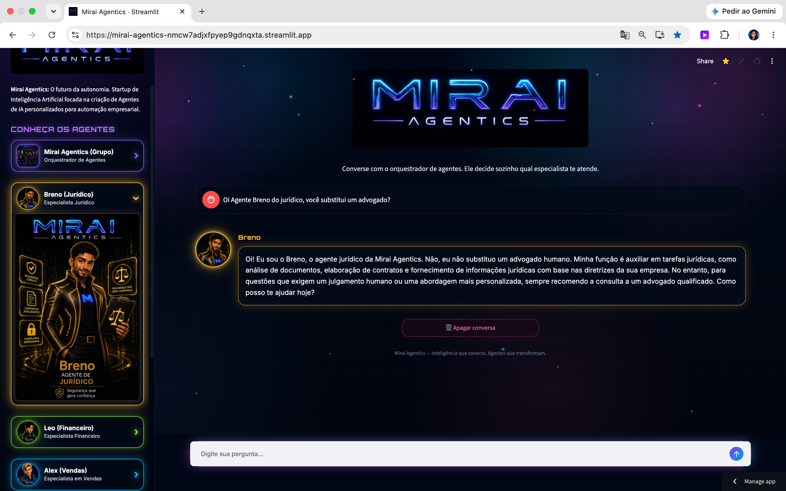
</details>

### 🟣 Mirai Agentics — Orquestrador e conhecimento institucional

<details>
<summary><strong>🧩 Quantidade de agentes e personalização</strong></summary>
<br>

**Pergunta testada:**  
> Quantos agentes a Mirai Agentics têm? Vocês fazem agentes personalizados?

A resposta apresenta os seis agentes especialistas e confirma a possibilidade de personalização de agentes conforme a necessidade do cliente.

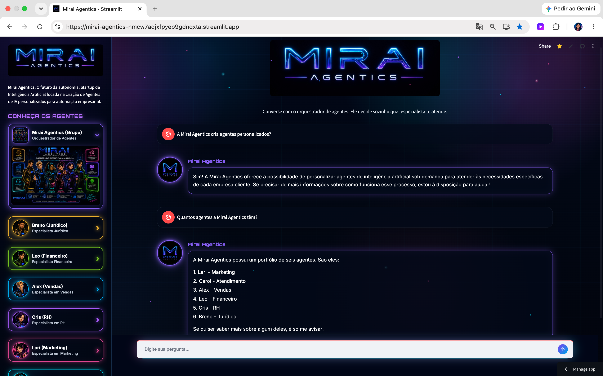
</details>

<details>
<summary><strong>🤖 Agentes não são robôs humanoides</strong></summary>
<br>

**Pergunta testada:**  
> Vocês Agentes são robôs humanoides? Vão substituir as pessoas?

A resposta explica que os agentes são inteligências artificiais e que o objetivo é apoiar e automatizar processos em colaboração com pessoas.

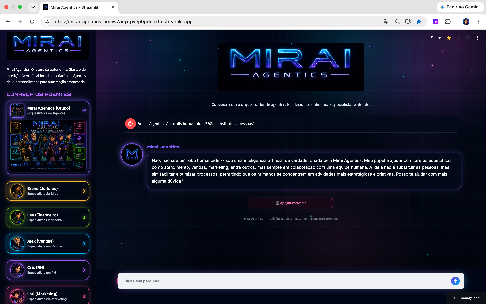
</details>

<details>
<summary><strong>🎯 Missão, visão e valores</strong></summary>
<br>

**Pergunta testada:**  
> Qual a missão, visão e valores da Mirai Agentics?

A captura demonstra recuperação de informações institucionais presentes na base documental.

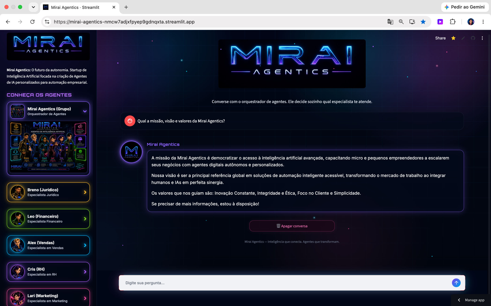
</details>

### 🛡️ Teste de fallback / proteção contra respostas fora da base

<details>
<summary><strong>🚫 Perguntas fora do escopo</strong></summary>
<br>

**Perguntas testadas:**

> Quem ganhou a Copa de 98?  
> Quem descobriu o Brasil?

Em ambos os casos, o sistema evita responder com conhecimento externo e informa que não encontrou a informação na base atual, mantendo o agente dentro do escopo documental definido para o projeto.

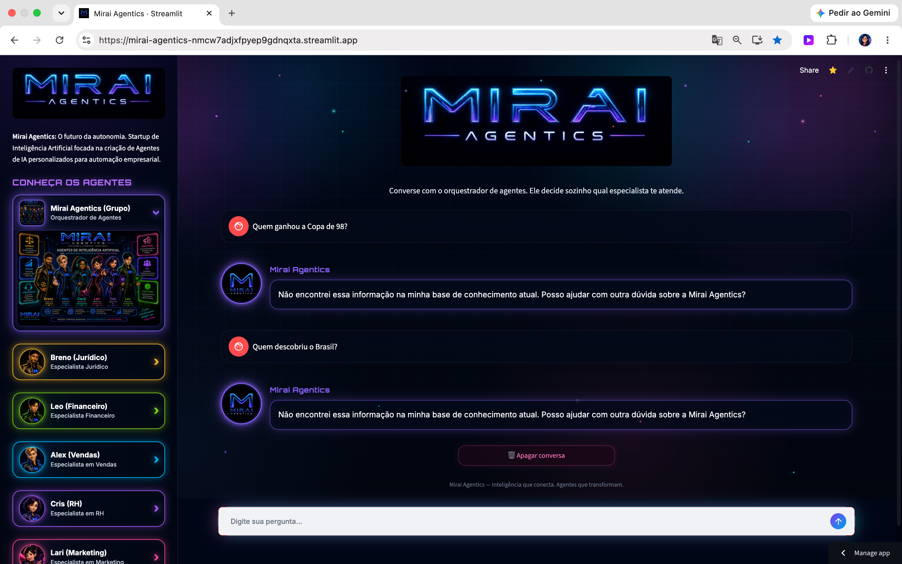
</details>

[⬆️ Voltar ao sumário](#sumario)

---

<a id="deploy"></a>
## ☁️ Deploy

### 🌐 Demonstração pública atual

A aplicação está publicada no **Streamlit Cloud** e conectada ao repositório do projeto.

🔗 **Aplicação:**  
https://mirai-agentics-nmcw7adjxfpyep9gdnqxta.streamlit.app/

As capturas da seção **📸 Evidências de funcionamento** mostram a aplicação rodando nesse endereço público durante os testes dos agentes.

### ☁️ Evidência de Deploy na OCI — Challenge Alura

O documento de entregáveis do Challenge solicita **evidência de deploy na OCI**.

Quando a implantação na Oracle Cloud Infrastructure estiver concluída, adicione:

- 🔗 URL pública da aplicação na OCI;
- 📸 captura de tela da aplicação executando na OCI;
- opcionalmente, uma captura da infraestrutura utilizada.

Exemplo de inclusão:

```md
### Oracle Cloud Infrastructure

🔗 **URL pública OCI:** SEU_LINK_AQUI


```

> ⚠️ **Atenção:** o deploy atual em Streamlit Cloud demonstra que a aplicação está online, mas não substitui a evidência de OCI caso esse item seja obrigatório na avaliação final.

[⬆️ Voltar ao sumário](#sumario)

---

<a id="checklist"></a>
## ✅ Checklist do Challenge Alura

| Entregável | Situação no projeto |
|---|---|
| Repositório público no GitHub | ✅ Concluído |
| Código-fonte do projeto | ✅ Concluído |
| Histórico de commits | ✅ Deve ser preservado no GitHub |
| Estrutura organizada | ✅ Projeto separado em interface, núcleo, assets e PDFs |
| Descrição geral no README | ✅ Concluído |
| Arquitetura da solução | ✅ Concluído |
| Tecnologias e ferramentas | ✅ Concluído |
| Instruções para executar | ✅ Concluído |
| Exemplos de perguntas | ✅ Concluído |
| Exemplos de respostas | ✅ Concluído |
| Agente inteligente funcional | ✅ Concluído |
| Leitura e processamento de PDF/CSV | ✅ PDFs com `PyPDFLoader` |
| Evidências visuais de funcionamento | ✅ Prints reais adicionados ao README |
| Aplicação pública em funcionamento | ✅ Streamlit Cloud |
| Evidência específica de deploy na OCI | ⚠️ Adicionar antes da entrega, se obrigatório |

[⬆️ Voltar ao sumário](#sumario)

---

<a id="autoria"></a>
## 👩‍💻 Autoria

**Erica Matsuzaki**

Projeto desenvolvido para o **Tech Builder Challenge — Oracle + Alura | ONE Next Education**.

<div align="center">

### ✨ Mirai Agentics
**Autonomia • Inteligência • Resultados**

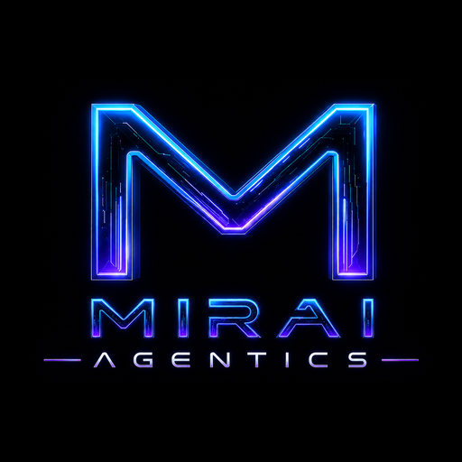

</div>

[⬆️ Voltar ao sumário](#sumario)
